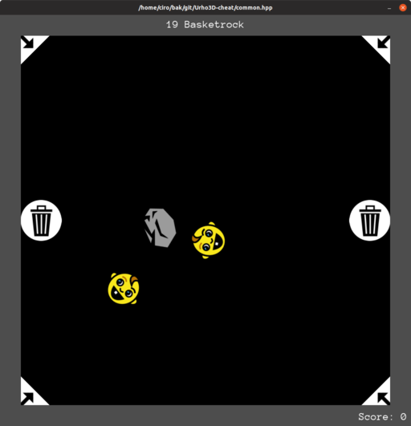

# Urho3D Cheat

Urho3D extra examples and demos. Tested in Ubuntu 18.04.

Build and run a demo:

    ./run

Video demo: https://www.youtube.com/watch?v=j_fl4xoGTKU

1.  [**Getting started**](getting-started.md)
1.  Minimal examples
    1.  [empty.cpp](empty.cpp)
    1.  [common_empty.cpp](empty.cpp)
    1.  [input.cpp](input.cpp)
    1.  [command_line_arguments.cpp](command_line_arguments.cpp)
    1.  [compound.cpp](compound.cpp)
    1.  [collision.cpp](collision.cpp)
    1.  [scale_sprite.cpp](scale_sprite.cpp)
    1.  [velocity_stop.cpp](velocity_stop.cpp)
    1.  [text.cpp](text.cpp)
    1.  [logic_component.cpp](logic_component.cpp)
    1.  [trigger](trigger.cpp)
1.  More interesting scenes
    1.  [pong.cpp](pong.cpp)
    1.  [biped.cpp](biped.cpp)
    1.  [food](food.cpp)
1.  3D
    1.  [collision3d.cpp](collision3d.cpp)
    1.  [compound3d.cpp](compound3d.cpp)
1.  [TODO](TODO.md)
    1.  [prismatic_collide_connected.cpp](prismatic_collide_connected.cpp)
    1.  [sprite_repeat](sprite_repeat.cpp)

Icons by <https://github.com/game-icons/icons>
